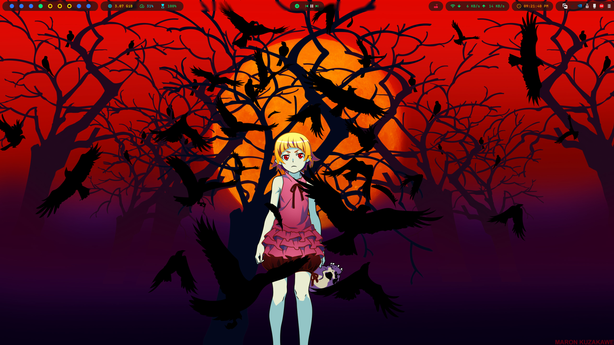
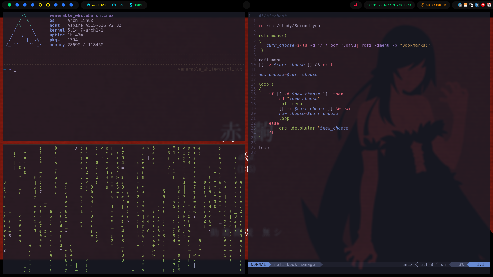
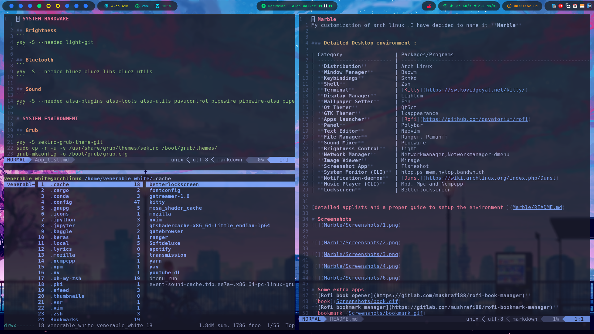
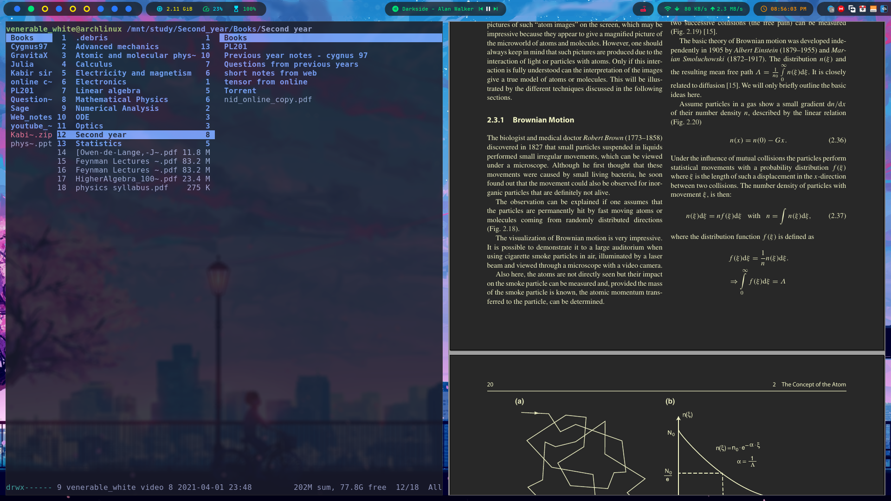
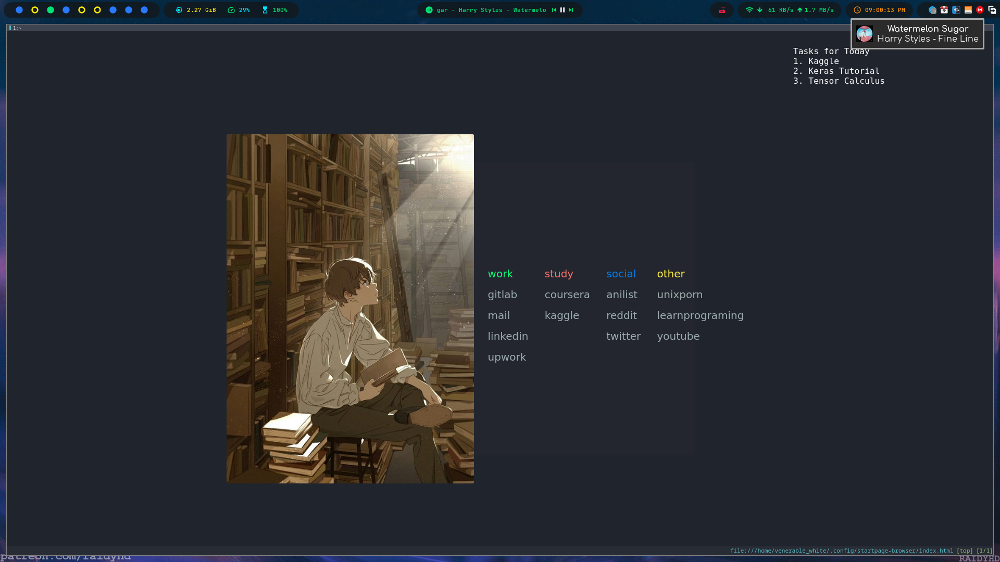

# Marble
My customization of arch linux .I have decided to name it **Marble**

### Detailed Desktop environment :

| Category                 | Packages/Programs                                                                                                      |
| ------------------------ | ---------------------------------------------------------------------------------------------------------------------- |
| **Distribution**         | Arch Linux                                                                                                             |
| **Window Manager**       | Bspwm																						|
| **Keybindings**          | Sxhkd                                                            | 
| **Shell**                | Zsh	                                                                                                                |
| **Terminal**             | [Kitty](https://sw.kovidgoyal.net/kitty/)                                                              				|
| **Display Manager**      | Lightdm																|
| **Wallpaper Setter**     | Feh                                                                                                               |
| **Qt Themer**            | Qt5ct                                                                                                                  |
| **GTK Themer**           | lxappearance                                                                                      |
| **Apps Launcher**        | [Rofi](https://github.com/davatorium/rofi)                                                                             |
| **Panel**                | Polybar                                                                             |
| **Text Editor**          | Neovim                                                                                                    |
| **File Manager**		   | Ranger, Pcmanfm                                                                                                             |
| **Sound Mixer**          | Pipewire                                                                                                             |
| **Brightness Control**   | light                                                          |
| **Network Manager**      | Networkmanager,Networkmanager-dmenu                                                   |
| **Image Viewer**         | Mirage                                                                 |               |
| **Screenshot App**       | Flameshot                                                    |
| **System Monitor (CLI)** | htop,ps_mem,nvtop,bandwhich                                                                                                                |
| **Notification-daemon**  | [Dunst](https://wiki.archlinux.org/index.php/Dunst)                    										        |
| **Music Player (CLI)**   | Mpd, Mpc and Ncmpcpp
| **Lockscreen**           | Betterlockscreen                                                                                                       |

[detailed applists and a proper guide to setup the environment ]([Marble/README.md##Marble)

# Screenshots

### Commonly used keybindings :

| Key stroke               | Program                                                                                                       |
| ------------------------ | ---------------------------------------------------------------------------------------------------------------------- |
| **Terminal**         | super + Return                                                                                                             |
| **Rofi app launcher**       | alt + F1																						|
| **Rofi network manager**          | super + n                                                            | 
| **Rofi powermenu**                | super + x	                                                                                                                |
| **Screenshot**             | ctrl + alt + p                                                              				|
| **Rofi Bookmark manager**      | ctrl + alt + b																|
| **Rofi Book manager**     | ctrl + alt + b                                                                                                               |
| **Rofi youtube searcher**            | ctrl + alt + y                                                                                                                  |
| **Kill an application**           | ctrl + alt + k                                                                                      |
| **Mpd increase/decrease sound**        | ctrl + alt + i/o                                                                             |
| **Ranger**                | ctrl + alt + h                                                                             |
| **System monitor**          | ctrl + alt + c                                                                                                      |
| **Qutebrowser**		   | ctrl + alt + f                                                                                                             |
| **Ncmpcpp**          | ctrl + alt + m                                                                                                             |
| **Lockscreen**   | ctrl + alt + l                                                          |
| **Reload Keybindings**      | super + escape                                                   |
| **Quite/restart bspwm**         | ctrl + alt + q/r                                                                 |               |
| **Close app**       | alt + F4                                                    |
| **Force close** | ctrl + alt + escape                                                                                                                |
| **Change-wallpaper** | alt + c                  |
|**Fullscreen or Monocle** |super + f  |
|**Split horizontal, vertical or cancel** | super + {h,v,c} |
|**Toggle beetwen floating & tiled** |super + space |
|**Pseudo Tiled & tiled mode**|super + {p,t}  |
|**Send the window to another edge of the screen**|super + {_,shift + }{Left,Down,Up,Right} |
|**Change focus to next window, including floating window**|alt + {_,shift + }Tab |
|**Switch workspace**| ctrl + alt + {Left,Right} |
|**Send focused window to another workspace**|super + {_,shift + }{1-8}|
|**Expanding windows**|super + control + {Left,Right,Up,Down}|
|**Shrinking windows**|super + alt + {Left,Right,Up,Down}|
|**Move floating windows**|alt + shift + {Left,Down,Up,Right}|
